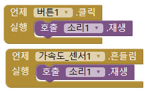
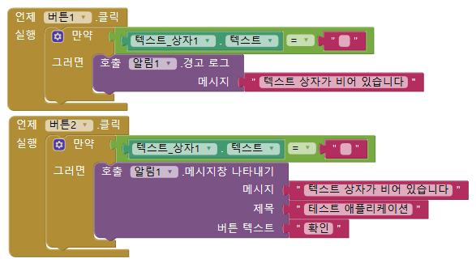
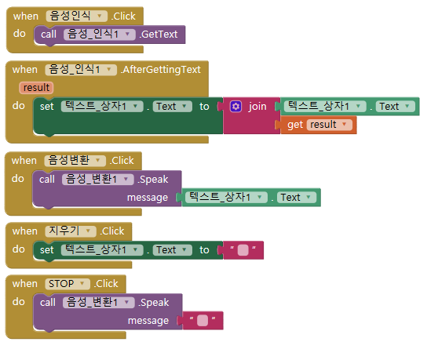

# App Inventor?

App Inventor는 Google과 MIT가 공동개발한 웹 애플리케이션입니다. 스크래치와 엔트리 같은 프로그램과 같이, 코드 블럭을 이용해서 안드로이드 앱을 쉽게 개발할 수 있다는 것이 특징입니다.

## 알아두기

- 텍스트코딩 및 XML을 이용할 수 없습니다. 앱인벤터 자체가 소프트웨어 교육 목적으로 만든 프로그램이기 때문입니다. 만약 만든 애플리케이션을 JAVA 프로젝트로 옮기고자 한다면, [JAVA Bridge](http://www.appinventor.org/jBridgeIntro)에 대해서 알아보세요. 

- *실제 서비스에 사용되는 앱의 경우, JAVA나 Kotlin 등으로 개발하는 것이 좋습니다.*

- [Kotlin](https://kotlinlang.org/)은 2017년에 안드로이드 공식 언어로 채택된 따끈따끈한 프로그래밍 언어입니다. 간결한 문법을 가졌고, 높은 생산성과 확장성을 지닌 매력적인 언어랍니다. 심지어 안드로이드 개발에 많이 사용되던 JAVA와의 상호 운영이 100% 지원되고, 라이브러리 역시 그대로 사용할 수 있습니다!

## 시작하기

1. [앱인벤터의 프로젝트 페이지](http://ai2.appinventor.mit.edu)에 접속합니다.

2. 구글 계정을 사용해서 로그인하고, 처음 사용하는 경우 이용약관에 동의합니다.

3. `Start new project` 버튼을 클릭해서 새로운 프로젝트를 생성하거나 작업할 프로젝트를 클릭해서 개발을 시작합니다.

### 앱인벤터 구조
외우지 마세요.

#### Designer
Android Studio의 Layout Editor 같은 UI(유저 인터페이스) 편집기입니다.

- 개발하는 앱의 스크린에서 사용하는 구성 요소(컴포넌트)와 그 기본 속성, 디자인을 관리할 수 있습니다.

##### Palette
개발에 사용할 수 있는 구성 요소(버튼, 미디어, 센서 등)가 있습니다. 필요한 구성 요소를 Palette에서 Viewer로 끌면 됩니다.

##### Viewer
편집 중인 스크린의 모습을 보여줍니다.

##### Components
현재 스크린에 포함된 구성 요소를 보여줍니다.

##### Properties
각각의 구성 요소의 속성을 지정하고 수정할 수 있습니다.

#### Blocks
실제 코딩이 이루어집니다.

Designer에서 구성 요소 객체를 추가하면, 추가된 객체에 대한 블럭이 추가됩니다. 빌트인 블럭과 함께 편집기로 드래그해서 사용하면 됩니다.

## 가속도 센서를 이용한 고양이 애플리케이션
이미지, 버튼, 가속도 센서, 소리 컴포넌트를 이용해서 휴대폰을 흔들거나 버튼을 누르면 고양이 울음소리를 재생하는 예제를 진행했습니다.

스크린에 이미지, 버튼, 가속도 센서, 소리 컴포넌트를 하나씩 추가하고 속성을 지정합니다.

버튼이 눌리거나 가속도 센서가 디바이스가 흔들리는 것을 감지하면 소리 컴포넌트의 속성에 지정된 미디어가 재생되도록 블럭들을 연결하면 됩니다.

## 텍스트 상자가 비어 있으면 알림 띄우기
텍스트 상자가 비어 있는지 확인하는 예제입니다.

버튼 컴포넌트 두 개와 텍스트 상자, 알림 컴포넌트를 추가하고 속성을 지정합니다.

빌트인 블럭들을 사용해서 위와 같은 코드를 만들 수 있습니다. 텍스트 상자의 텍스트와 빈 문자열을 비교하는 방법으로 텍스트 상자가 비어 있는지 확인하는 것이죠.

텍스트 상자가 비어 있는 상태에서 `버튼 1`을 누르면 Toast 알림이 나타나고 `버튼 2`를 누르면 경고창(Alert Dialog)이 나타납니다.

## 음성 변환, 음성 인식 앱 만들기
다음으로는 음성 변환, 음성 인식 컴포넌트를 이용하는 예제를 진행했습니다.

- `음성 인식` 버튼은 텍스트 상자의 텍스트를 사용자에게 입력받은 음성을 텍스트로 변환한 값으로 설정합니다.

- 사용자가 텍스트 상자에 직접 텍스트를 입력하고 `음성 변환` 버튼을 누르면 텍스트 상자의 텍스트를 음성으로 변환해서 재생합니다.

- `지우기` 버튼은 현재 텍스트 상자의 텍스트를 모두 지우고, 음성이 재생되고 있는 동안 
`STOP` 버튼을 누르면 재생이 멈춥니다.

강사님께서는 `지우기`를 눌렀을 때 텍스트 박스가 비어 있으면 알림을 표시하게 하는 기능을 구현하는 것을 숙제로 내셨습니다.

교육에 참여한 동아리원 모두 수고하셨고 숙제 역시 해보시면 좋을 것 같네요!
