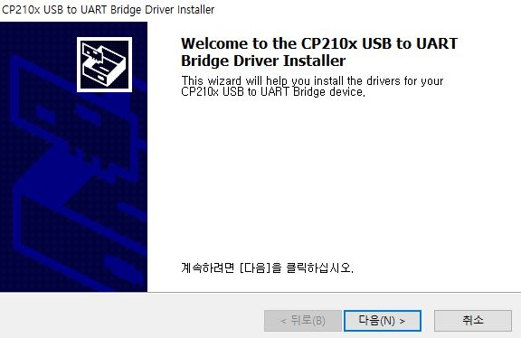
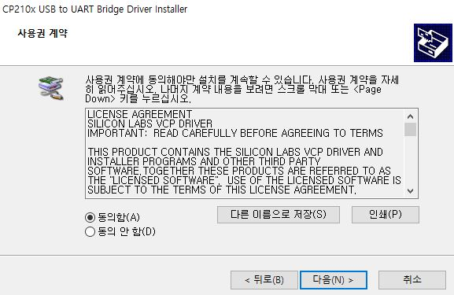
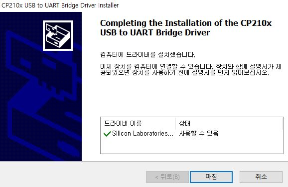
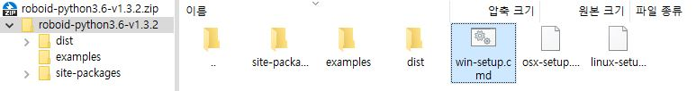
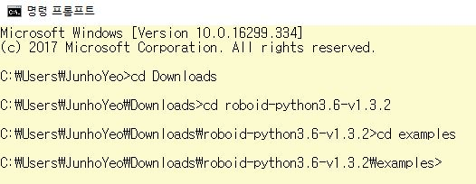
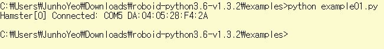

# 햄스터 로봇 시작하기
```
본 문서는 은여울중학교 컴퓨터공학 동아리 스위치(*Switch)에서
교육 자료로 사용하기 위해서 만들어졌습니다.
다른 스위치(*Switch) 저장소에 있는 파일과 같이, 이 문서 역시 MIT License를 따릅니다.
Copyright (c) 2018 JunhoYeo
```

## 공식 튜토리얼을 살펴봐요.
시작하기 앞서, 먼저 햄스터 스쿨 공식 사이트에서 제공하는 [튜토리얼(교육 자료)](http://hamster.school/ko/tutorial/)을 읽어봅시다. <br>
어떤 프로그래밍 도구나 언어를 지원하는지, 하드웨어([햄스터 로봇](http://hamster.school/ko/tutorial/python/hamster.jsp), [USB dongle](http://hamster.school/ko/tutorial/python/dongle.jsp))의 사양과 구성, 사용방법은 어떻게 되는지를 훑어보는 것은 어떨까요?

마지막으로, 이 기회에 한 가지 더 말씀드리자면 이 문서를 읽으면서 **모르거나 궁금한 것이 생기면 질문하기 전에 직접 구글에서 검색해서 찾아보세요.**<br>

- 자신이 직접 검색해서 답을 찾아가다 보면 개발 실력이 더 늘 것입니다.
- 네이버나 다음보다 구글을 사용해서 검색하면 더 많은 자료들을 찾을 수 있을 거예요.
- 영어를 사용해서 검색하면 한국어 검색결과보다 더 자세한 정보를 얻을 수 있어요.
- 크롬 쓰면 빨라요.
- 간단한 검색어를 사용하세요. 검색 엔진에 `어떻게 하면 A로 B를 할 수 있을까요?`를 때려넣는 것보다 그냥 `A B`, `do B with A` 등으로 검색하는 게 더 좋습니다. 검색하는 스킬도 여러 번 하면 저절로 늡니다.
- 실무에서도 구글링은 유용하게 쓰일 것입니다. 검색도 능력이니 이 기회에 제발 좀 배워보세요.

## 어떻게 개발할 수 있을까요?
[튜토리얼(교육 자료)](http://hamster.school/ko/tutorial/)에서 명시된 대로, 햄스터 로봇은 아래 같은 프로그래밍 도구/언어로 프로그래밍이 가능합니다.<br>
하나씩 간단하게 알아보고 진행하도록 하겠습니다.

- 스크래치
- 엔트리
- 플레이봇

> [스크래치(Scratch)](https://scratch.mit.edu/)와 [엔트리(Entry)](https://playentry.org/)는 소프트웨어 교육용으로 개발된 블럭 코딩 방식의 프로그래밍 도구입니다. <br>

> [플레이봇(Playbot)](http://playbot.spaceii.com/) 역시 소프트웨어 교육용 언어이지만 스크래치와 엔트리와 달리 텍스트 코딩 방식을 사용합니다.<br>

- `Processing`
- `Python`
- `JavaScript`
- `C`
- `JAVA`

> [프로세싱(Processing)](https://processing.org/)은 미디어 아트를 위해서 개발된
프로그래밍 언어입니다. 아두이노와 연동해 받은 데이터를 시각화한다던가 하는 데 쓰이기도 합니다.<br>

> [파이썬(Python)](https://www.python.org/)은 인터프리터 방식의 프로그래밍 언어로 문법이 매우 간결해 생산성이 높고 지원되는 패키지도 많습니다. 빅데이터 분석이나 인공지능 개발, 웹 애플리케이션 제작 등 많은 분야에 사용됩니다. <br>

> [자바스크립트(JavaScript)](#)는 객체 기반의 스크립트 프로그래밍 언어입니다. `React`, `Node.js`, `Vue.js`, `Angular` 등 다양한 자바스크립트 프레임워크가 있습니다. 자바스크립트는 후술할 프로그래밍 언어인 `JAVA`와는 관련이 없습니다.<br>

> [C언어](#)는 역사가 깊고 성능이 좋은 언어입니다. `C`는 `C++`, `C#`, `Python` 등의 많은 언어에 영향을 주었기 때문에 프로그래밍의 기초를 배우기 좋습니다.<br>

> [자바(JAVA)](https://java.com/)는 `Sun Microsystems`(현재 `Oracle`이 인수)에서 개발한 객체지향 프로그래밍 언어입니다. 웹 애플리케이션 개발 및 모바일 디바이스 소프트웨어 개발에 사용되고 있습니다.<br>

위와 같이 햄스터 로봇은 많은 프로그래밍 도구/언어를 지원하지만, 동아리 수업에서는 이들 중 `Scratch`와 `Python`을 사용해서 개발하도록 하겠습니다.

## 디바이스 드라이버 설치하기
햄스터 스쿨 공식 사이트에 있는 [안내](http://hamster.school/ko/download/driver.jsp)에 따라 디바이스 드라이버를 설치해 주세요.<br>

<br>

`Windows 10` 환경을 기준으로 설명하겠습니다. 다운로드 받은 `Installer`를 실행하면 위와 같은 화면이 나올 것입니다. `[다음]` 버튼을 클릭해서 설치를 진행하도록 하겠습니다.<br>

<br>

사용권 계약에 동의해야만 드라이버를 설치할 수 있으므로, `[동의함(A)]`을 선택하고 `[다음]` 버튼을 클릭해서 계약에 동의하겠습니다.<br>

<br>

설치가 시작된 이후 위와 같은 창이 뜨면서 설치가 끝났음을 알립니다. `[마침]`을 눌러서 `Installer`를 닫습니다.

## Scratch로 개발하기
추가예정

## Python으로 개발하기

#### Python 설치
먼저 `Python`을 설치해야 합니다.<br>

- [햄스터 스쿨에서 제공하는 설치 튜토리얼](http://hamster.school/ko/tutorial/python/install_python.jsp#python3-win)
- 필자가 이전에 작성한 [설치 튜토리얼](https://github.com/JunhoYeo/Study/tree/master/Python#installing-python)을 보고 설치하면 될 것 같습니다. ~~정말 잘 쓴 것 같아~~

현재 `Python`은 `2.7`와 `3`, 두 버전이 존재합니다. 두 버전은 서로 호환되지 않기 때문에 둘 중 하나를 선택해야 합니다. `Python3`가 더 강력하기 때문에 동아리에서는 `Python3`을 기준으로 진행하겠습니다.

#### 라이브러리 설치

<br>

설치한 `Python`의 버전은 `CMD`에서 `python --version` 명령어를 입력하는 것으로 알 수 있습니다.<br>
필자의 노트북에는 `Python 3.6.4` 버전이 설치되어 있습니다.<br>
햄스터 스쿨의 [다운로드 페이지](http://hamster.school/ko/download/#python)에서 버전에 맞는 라이브러리 압축 파일을 다운로드 받습니다.<br>
역시 `Windows 10` 환경 기준으로 설명하겠습니다.<br>

<br>

압축 파일을 열고 폴더에 압축을 풀면 위와 같이 `win-setup.cmd` 파일이 보일 것입니다. 해당 파일을 실행하면 자동으로 필요한 라이브러리가 설치될 것입니다.<br>
압축을 풀지 않고 압축 프로그램에서 바로 실행했을 경우, 에러가 발생할 수 있으니, 반드시 압축을 풀고 진행하시길 바랍니다.

#### 페어링
햄스터 로봇과 USB dongle을 연결하는 페어링은 정보 선생님께서 미리 시켜 두셨으니 패스하면 됩니다.<br>
햄스터 로봇과 USB dongle의 번호가 일치하는지 확인해 보세요!

#### 예제 파일 실행
이제 예제 프로그램을 실행해 보도록 하겠습니다.<br>
`라이브러리 설치` 단계에서 다운받은 라이브러리 폴더에 예제 파일이 있는 폴더, `examples/`가 있습니다.<br>
`CMD`를 열고 `cd` 명령을 이용해서 `examples/` 폴더가 있는 곳으로 이동해 봅시다.<br>

<br>

위와 같이 `cd (이동할 폴더)` 명령을 사용해서 명령 프롬프트 상에서 원하는 폴더로 이동할 수 있습니다.<br>
`Tab` 키를 사용하면 폴더명/파일명을 끝까지 입력할 필요 없이 자동 완성 기능을 이용할 수 있습니다. 앞 몇 글자만 입력하시고 `Tab` 키를 누르시면 됩니다.<br>
이제 USB dongle을 컴퓨터의 USB 포트에 연결하고, 햄스터 로봇의 전원을 켭니다.<br>

<br>

`python example01.py` 명령을 입력하면 위와 같이 햄스터 로봇의 연결 정보가 출력되면서 로봇이 앞뒤로 움직일 것입니다.<br>
이렇게 `python (실행할 Python 스크립트 이름)` 명령어를 사용해서 Python 스크립트를 실행할 수 있습니다.<br>

Python 스크립트 파일의 끝에는 `.py`가 붙습니다. 이는 그 파일의 `확장자(filename extension)`라고 합니다. 확장자는 해당 파일이 무슨 종류인지, 어떤 역할을 하는지를 나타냅니다.

그렇다면 직접 Python 스크립트를 프로그래밍하고 실행할 수는 없을까요? 당연히 가능합니다! 다음 시간에서는 Python 스크립트를 직접 작성하고 실행해 보도록 하겠습니다. **(끝)**
